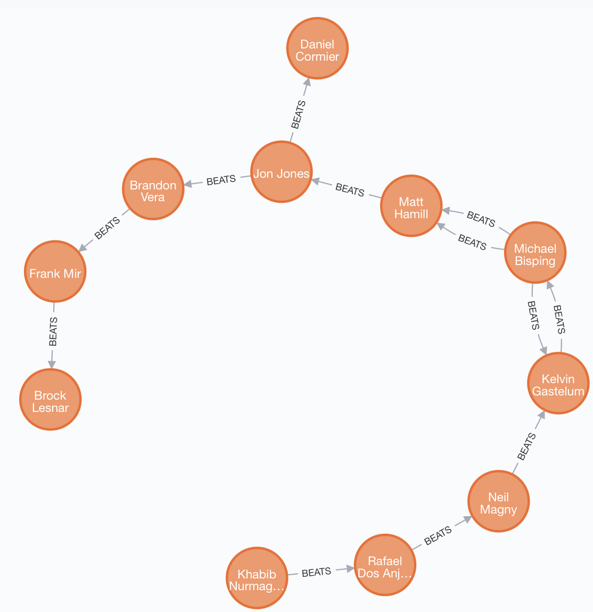
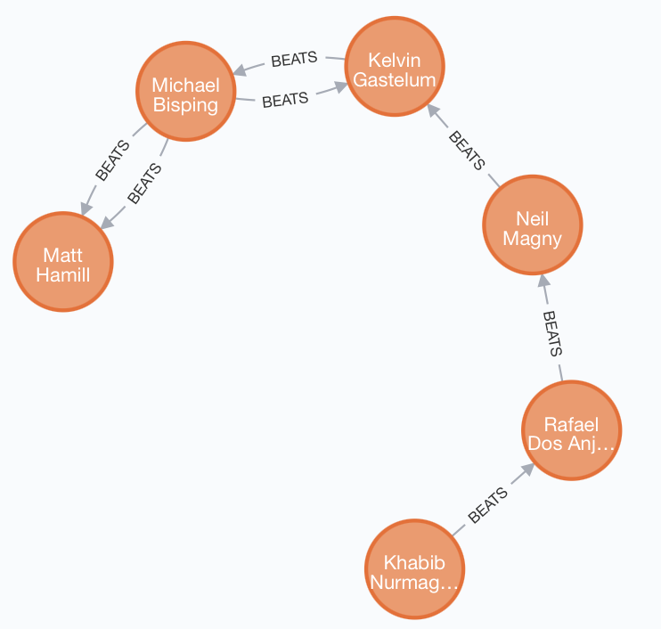
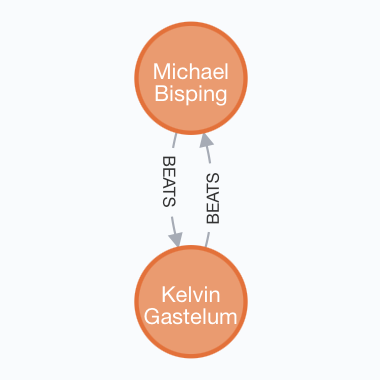
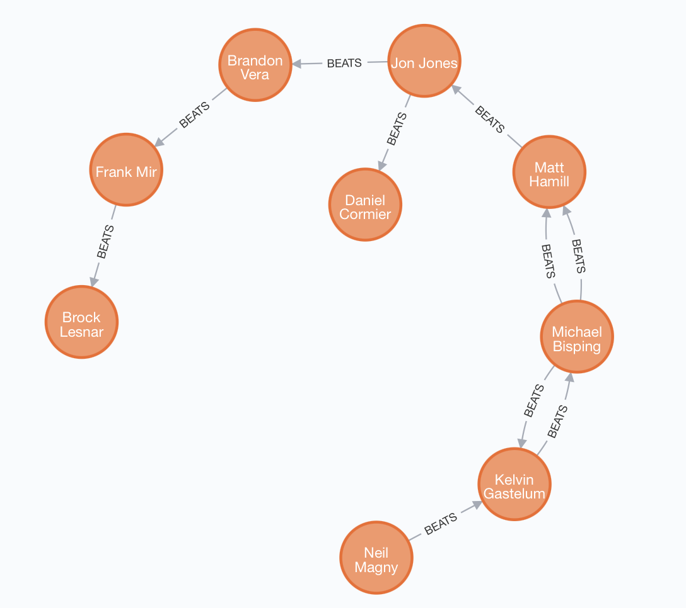
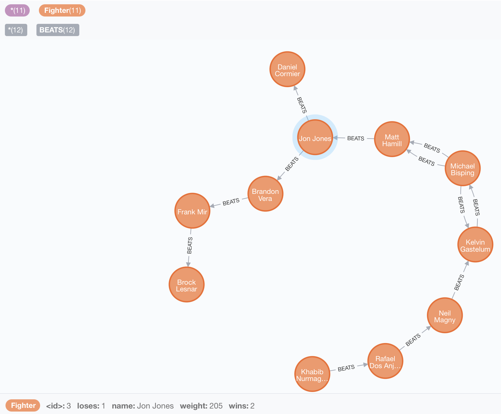

# Exercise 1. Part 1

## Build a representation of the relationship between the following fighters
```
CREATE (fighter1:Fighter{name:"Khabib Nurmagomedov", weight:155}),
       (fighter2:Fighter{name:"Rafael Dos Anjos", weight:155}),
       (fighter3:Fighter{name:"Neil Magny", weight:170}),
       (fighter4:Fighter{name:"Jon Jones", weight:205}),
       (fighter5:Fighter{name:"Daniel Cormier", weight:205}),
       (fighter6:Fighter{name:"Michael Bisping", weight:185}),
       (fighter7:Fighter{name:"Matt Hamill", weight:185}),
       (fighter8:Fighter{name:"Brandon Vera", weight:205}),
       (fighter9:Fighter{name:"Frank Mir", weight:230}),
       (fighter10:Fighter{name:"Brock Lesnar", weight:230}),
       (fighter11:Fighter{name:"Kelvin Gastelum", weight:185}),
       (fighter1)-[:BEATS]->(fighter2),
       (fighter2)-[:BEATS]->(fighter3),
       (fighter4)-[:BEATS]->(fighter5),
       (fighter6)-[:BEATS]->(fighter7),
       (fighter4)-[:BEATS]->(fighter8),
       (fighter8)-[:BEATS]->(fighter9),
       (fighter9)-[:BEATS]->(fighter10),
       (fighter3)-[:BEATS]->(fighter11),
       (fighter11)-[:BEATS]->(fighter6),
       (fighter6)-[:BEATS]->(fighter7),
       (fighter6)-[:BEATS]->(fighter11),
       (fighter7)-[:BEATS]->(fighter4)

```
# Results:




# Exercise 1. Part 2

* ## Return all middle/Walter/light weight fighters (155,170,185) who at least have one win
```s
MATCH (fighter:Fighter)-[:BEATS]-(another_fighter:Fighter)
WHERE fighter.weight IN [155, 170, 185]
RETURN fighter
```

## Results:



* ## Return fighters who had 1-1 record with each other. Use Count from the aggregation functions
```
MATCH (fighter:Fighter)-[b:BEATS]->(another_fighter:Fighter), (another_fighter:Fighter)-[b2:BEATS]->(fighter:Fighter)
WITH count(b) as c1, count(b2) as c2, fighter as f
WHERE c1=1 AND c2=1
RETURN f
```
## Results:



* ## Return all fighter that “Khabib Nurmagomedov” can beat them and he didn’t have a fight with them yet
```
MATCH (fighter:Fighter)-[:BEATS*]->(another_fighter:Fighter), (another_fighter:Fighter)-[:BEATS*]->(others:Fighter)
WHERE fighter.name = "Khabib Nurmagomedov" AND another_fighter.name <> others.name
RETURN others
```
## Results:



* ## Return undefeated Fighters(0 loss), defeated fighter (0 wins)
```
MATCH (winner:Fighter) WHERE NOT (winner)<-[:BEATS]-(:Fighter) RETURN winner
```
## Results:


```
MATCH (loser:Fighter) WHERE NOT (loser)-[:BEATS]->(:Fighter) RETURN loser
```
## Results:


* ## Return all fighters MMA records and create query to enter the record as a property for a fighter {name, weight, record}
```
MATCH (fighter:Fighter)
SET fighter.wins = size((fighter)-->()), fighter.loses = size((fighter)<--())
RETURN fighter
```
## Results:


